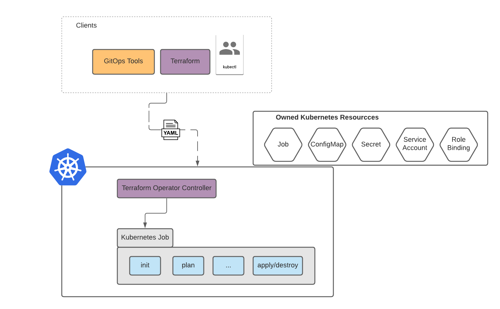

# Terraform Operator Design
Here is how the terraform operator works



Let's say you created and applied the following manifest to Kubernetes:

```yaml
apiVersion: run.terraform-operator.io/v1alpha1
kind: Terraform
...
spec:
  terraformVersion: 1.0.2

  module:
    source: "IbraheemAlSaady/test/module"
    version: "0.0.1"

  variables:
    - key: length
      value: "16"
      environmentVariable: false

  outputs:
    - key: result
      moduleOutputName: result ## <-- the module has an output called result
```

Once the Terraform object was created, the controller will pick up the object and create a Kubernetes job. That Kubernetes job runs the [Terraform Runner](#) which will run the Terraform flow and install the required terraform version

Based on our template, the controller will create a main.tf file with the following content and mounts it into the `terraform runner` job

```terraform

variable "length" {}

module "operator" {
  source = "IbraheemAlSaady/test/module"
  version =  "0.0.1"

  length = var.length

  output "result" {
    value = module.operator.result
  }
}

```

The controller then will start monitoring the Job status and once completed/failed, the controller will update the Status of the Terraform object.

You may be wondering, but where did the `length` variable value is coming from? The controller will append the `TF_VAR_` to any varialbe that has `environmentVariable` set to `false`, then later will inject it to the Kubernetes Job as an environment variable.

Aside from the Job, with each Terraform run, the controller will create the following resources:

1. **ConfigMap:** this will contain the module rendered as shown above and will be mounted into the terraform runner job
2. **Secret:** for outputs to be stored

If `spec.outputs` were defined in the manifest, the outputs will be added to the secret created by the controller